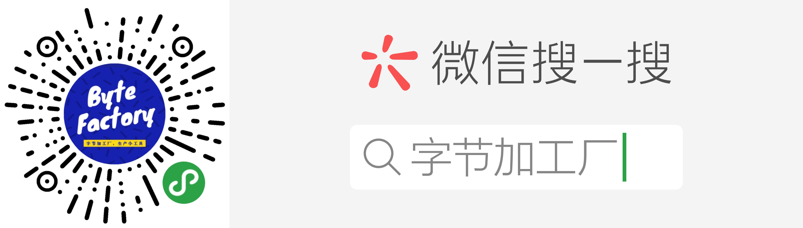

# 小程序开发系列文章
记录微信小程序「字节加工厂」的开发过程，总体分为**产品思路**和**开发实战**两个部分。

### 目录
- [小程序开发入门](./first.md)
- [产品思路](./product/index.md)
    - [收藏地址](./product/01_tool-address.md)
    - [计算日子](./product/02_tool-days.md)
    - [计算日子 - 纪念功能](./product/03_tool-days2.md)
    - [账号箱](./product/04_tool-account.md)
    - [历史上的今天](./product/05_tool-history.md)
    - [写给未来的信](./product/06_tool-future.md)
    - [文字封面](./product/07_tool-wxcover.md)
    - ......
- [开发实战](./develop/index.md)
    - [一个列表就可以是一个小程序](./develop/01_a-list-a-miniprogram.md)
    - [初次使用 Canvas 画布](./develop/canvas-first-use.md)
    - [Canvas 画布进阶使用](./develop/canvas-advanced.md)
    - [如何调用第三方数据接口](./develop/how-to-use-the-third-data.md)
    - [初步使用云函数开发](./develop/cloud-develop.md)
    - ......

### 附录1：小程序示意图

### 附录2：小程序码

### 附录3：交流方式
欢迎扫描下方二维码，加入免费的知识星球，一起探讨小程序的产品设计与开发。

也可以关注我的微信公众账号：**个人学习**，了解我的个人成长经历。

