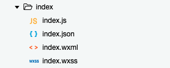
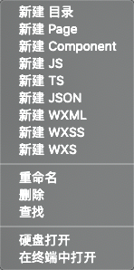

不同于 Web 页面的开发，小程序页面的开发有很多定制化的规定。例如，它不用像传统网页开发那样，需要在代码中引入样式文件（CSS）以及脚本文件（JS）,这些规则都直接封装在小程序的框架中了。

结合微信开发者工具，页面注册以及页面创建等操作，都实现了自动化。建议直接使用微信开发者工具进行小程序开发，一方面可以实时调试，另一方面避免造成莫名的错误。

### 目录结构
每一个页面对应一个目录，目录里有 4 个文件：wxml、wxss、js 以及 json，它们分别代表页面结构、样式、逻辑以及配置，4 个文件的命名，必须是一样的，否则会报错。如下图所示：



在微信开发者工具中，右键可以很方便的创建一个页面，选择「新建 Page」，会自动生成这 4 个文件。



### 事件函数
自动生成 js 文件中，会写入默认的代码，如下所示：

```js
Page({
  /**
   * 页面的初始数据
   */
  data: {

  },

  /**
   * 生命周期函数--监听页面加载
   */
  onLoad: function (options) {

  },

  /**
   * 生命周期函数--监听页面初次渲染完成
   */
  onReady: function () {

  },

  /**
   * 生命周期函数--监听页面显示
   */
  onShow: function () {

  },

  /**
   * 生命周期函数--监听页面隐藏
   */
  onHide: function () {

  },

  /**
   * 生命周期函数--监听页面卸载
   */
  onUnload: function () {

  },

  /**
   * 页面相关事件处理函数--监听用户下拉动作
   */
  onPullDownRefresh: function () {

  },

  /**
   * 页面上拉触底事件的处理函数
   */
  onReachBottom: function () {

  },

  /**
   * 用户点击右上角分享
   */
  onShareAppMessage: function () {

  }
})
```

一个 Page 对象包含了 Data 属性，以及 8 个页面监听函数，分别是：

- onLoad：页面创建时执行
- onShow：页面显示到前台时执行
- onReady: 页面首次渲染完毕时执行
- onHide：页面从前台转到后台时执行
- onUnload：页面销毁时执行
- onPullDownRefresh：下拉刷新时执行
- onReachBottom：页面触底时执行
- onShareAppMessage：页面被用户分享时执行

除了上面 8 个监听函数，官方文档中，还列举了如下 3 个：

- onPageScroll：页面滚动时执行
- onResize：页面尺寸变化时执行
- onTabItemTap：tab 点击时执行

微信小程序以及开发工具还在高速发展阶段，很多内容还在更新中，所以，实时关注官方文档是最重要的。

### 生命周期