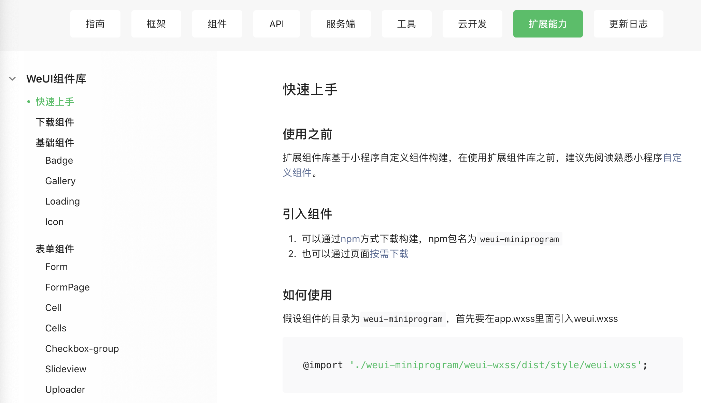
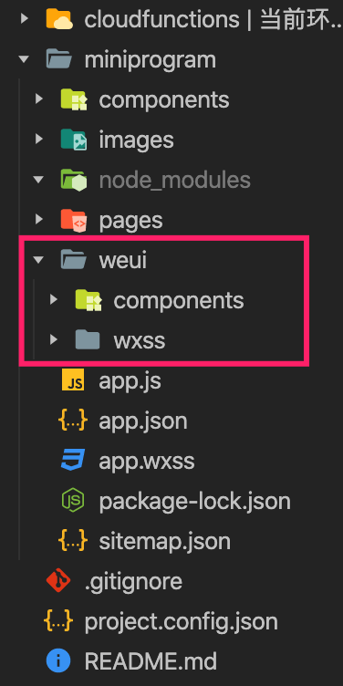

### 安装 weiui

https://developers.weixin.qq.com/miniprogram/dev/extended/weui/quickstart.html



注意：如果通过 npm 下载的，会自动帮你创建 `node_modules` 目录，建议将组件和基础样式提取出来，放在项目的根目录中，可参考下图所示。



在 `app.wxss` 中引入样式代码如下：

```css
@import "./weui/wxss/dist/style/weui.wxss"
```

至于组件的引入，建议用到哪个组件，就在对应页面的 `json` 文件中引入。

样式这块搞定之后，接下来就是页面的实际开发了，这块内容基本上就是对 weui 组件的应用，我就不多讲了，其实也没啥可讲的，大抵上就是在调整页面布局。

下面贴出所有页面的最终效果图：

【图片】

代码可以在项目中自行查看。

